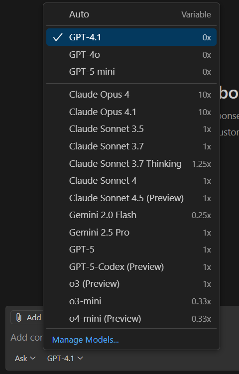

# Understanding the Project

Before we start migrating code, it's crucial to understand what we're working with.

## Start with the Python Project
Familiarize yourself with the project and its structure. The main file is `main.py`, and is located within the `src` directory, under the `python-app\webapp` folder. This file contains the main logic of the application. 

### 1. Explore the project 

> Try using GitHub Copilot in Ask Mode for this step.

First, open GitHub Copilot by pressing `Ctrl + Alt + I` if you are on Windows, or `Command + Shift + I` if you are on Mac, and ensure you are in **Ask** Mode:


!!! Note
    GitHub Copilot is based on LLMs and therefore it has a non-deterministic behavior; you might get different responses to the same input prompt. The suggested prompts in this repo have been tested with model **GPT-4.1**, so you might want to choose that model from the dropdown menu. However, you are also welcome to explore different models.



Use the `#codebase` tool to provide context to Copilot and explain what is going on with this project.

- Open GitHub Copilot Chat and prefix your prompt with `#codebase`
- Ask questions like how to run the project

??? question "Tip"

    Prompt (Ask Mode)

    ```text
    #codebase provide me a detailed summary of what this Python project is about
    ```


### 2. Determine the API endpoints

> *Try using GitHub Copilot in Ask Mode for this step.*

Next, we will launch the project and run the web application. Let's use GitHub Copilot chat with the `main.py` file open, or type `#main.py` to provide context and ask about the endpoints.

!!! tip "When Copilot output include a terminal command you can click on the button in the right upper corner to paste it directly in the terminal. "

- Ask how to run the web application

??? question "Tip"

    Prompt (Ask Mode)

    ```text
    #main.py how do I run the python webapp? 
    ```

- Try to run the project based on the suggestions of Copilot  

!!! tip "You'll need to have a terminal opened in your codespace and you'll need **uvicorn** to execute the FastAPI application."

!!! warning
    If you are getting the following error message "Error loading ASGI app. Could not import module (...)", make sure the path suggested by Copilot in its output is the correct file path of the app logic (main.py).

- See all the possible endpoints and their requests types, by navigating to the swagger UI page, whose url is printed in the app startup output. 

!!! tip "Have a look to [weather.json](https://github.com/microsoft/aitour26-WRK541-real-world-code-migration-with-github-copilot-agent-mode/blob/main/src/python-app/webapp/weather.json) file to check the allowed parameters to test the endpoints."

### 3. Explore and run the shell tests

> *Try using GitHub Copilot in Agent Mode for this step.*

Tests are provided in the `tests` directory under `src/python-app/webapp`. Open the `test_endpoints.sh` file and use it to run tests. It requires the Python application to be running. Run the tests and inspect the output.

Open a new bash terminal and run it:

```bash
bash ./tests/test_endpoints.sh
```

- If any tests are not currently passing, leverage GitHub Copilot to help you fix them and then re-run the tests.

!!! warning
    The application must be running for the tests to pass. If the app is not running you will get http errors.
    You can ask GitHub Copilot in Agent Mode for help to run the application and gain insights on how to start it.
